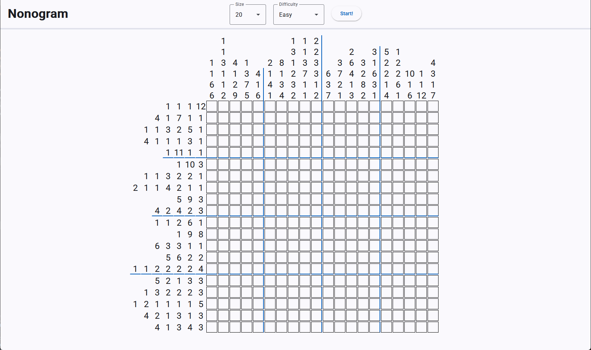

# Nonogram

Hosted at: https://nonogram.pfliegler.at/

</img>

## TODOs
- Confirmation dialogue when starting a new game if the current game is edited
- Save state in local storage
  - Resume game from local storage
- Allow share button and url-encode state
  - Resume game from url-encoded parameter
- Smarter puzzle creation algorithm
  - Check solvability
  - Investigate solving-difficulty
- Congratulations message on puzzle completion
- Statistics
  - E.g. Total solved puzzles, daily streak, 
- Info screen
  - Game rules and mouse controls
- Check Browser Compatability (Safari :^))
- Mobile version
  - Mobile friendly input and styling
  - Build for mobile devices (with Capacitor? https://capacitorjs.com/)
