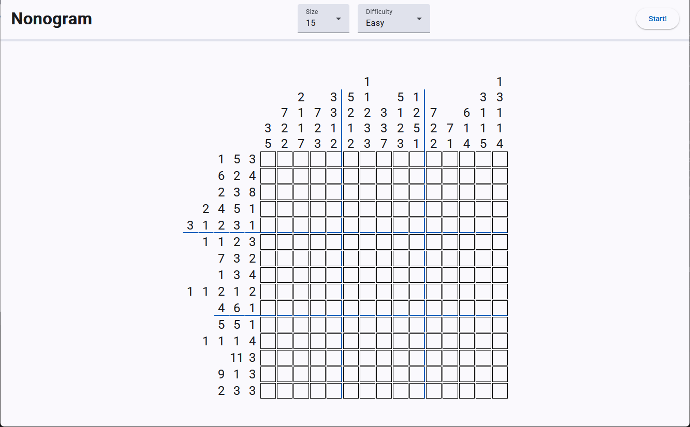
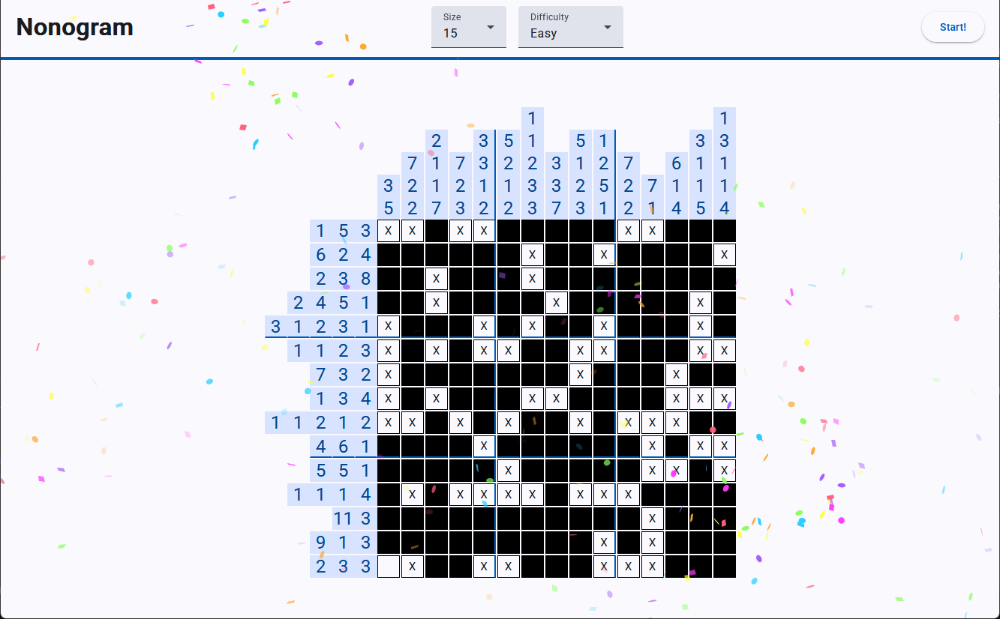

# Nonogram
An Angular application that lets you play and solve Nonogram (Picross) puzzles.

Hosted at: https://nonogram.pfliegler.at/

</img>
</img>

## TODOs
- [ ] Confirmation dialogue when starting a new game if the current game is edited
- [ ] **Smarter puzzle creation algorithm**
  - [ ] **Check solvability**
  - [ ] **Investigate solving-difficulty**
  - e.g. https://doi.org/10.3233/ICG-2012-35402 , https://doi.org/10.1016/j.patcog.2008.12.003 , https://doi.org/10.1016/j.dam.2014.01.004 , https://fse.studenttheses.ub.rug.nl/id/eprint/15287
- [x] Save state in local storage
  - [x] Resume game from local storage
- [ ] Hint button (i.e. reveal random square)
- [ ] Congratulations message on puzzle completion
- [ ] Statistics
  - [ ] E.g. Total solved puzzles 
  - [x] daily streak
- [ ] Info screen
  - [ ] Game rules and mouse controls
- [ ] Clean up mouse and touch controls (merge common functionality)
- [x] Mobile version
  - [x] Mobile friendly input and styling
  - [x] Build for mobile devices (with Capacitor? https://capacitorjs.com/)
